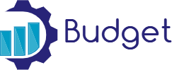

<a name="readme-top"></a>

<div align="center">
  
 
 
  <h1><b>Ruby on Rails Budget App</b></h1>
</div>
<!-- TABLE OF CONTENTS -->
 </div>
# 📗 Table of Contents

- [📖 About the project](#-about-project)
  - [🛠 Built With ](#-built-with-)
    - [Tech Stack ](#tech-stack-)
    - [Key Features ](#key-features-)
    - [🚀 Live Demo](#live-demo)
    - [🔭 Video Presentation](#video)
  - [💻 Getting Started ](#-getting-started-)
    - [Prerequisites](#prerequisites)
    - [Setup](#setup)
    - [Install](#install)
    - [Usage](#usage)
  - [👥 Author : ](#-author--)
  - [🔭 Future Features ](#-future-features-)
  - [🤝 Contributing ](#-contributing-)
  - [⭐️ Show your support ](#️-show-your-support-)
  - [🙏 Acknowledgments ](#-acknowledgments-)
  - [❓ FAQ ](#-faq-)
  - [📝 License ](#-license-)
  <div>
  <!-- PROJECT DESCRIPTION -->
 <h2>📖 Budget_App<a name="about-project"></a></h2>

The Ruby on Rails Budget app is a mobile web application that user can manage and track budget. One can view category list and transactions.

## 🛠 Built With <a name="built-with"></a>

- Ruby

### Tech Stack <a name="tech-stack"></a>

<details>
  <summary>Client</summary>
  <ul>
    <li>Ruby</li>
  </ul>
</details>
<details>
  <summary>Test</summary>
  <ul>
    <li>RSPEC</li>
  </ul>
</details>
<details>
<summary>Database</summary>
  <ul>
    <li>PostgreSQL</li>
  </ul>
</details>

<!-- Features -->

### Key Features <a name="key-features"></a>

- Categories page.
- Transactions page.
- User authentication and authorization.
- Forms
- Validations and Model specs.
- Integration specs for Views.

<p align="right">(<a href="#readme-top">back to top</a>)</p>

### 🚀 Live Demo <a name="live-demo"></a>

Please click <a href="https://budget-iuue.onrender.com/" target="_blank">here</a> to go live with the application.

### 🔭 Video Presentation <a name="video"></a>

Please click <a href="https://youtu.be/GuNyhHLVo-c" target="_blank">here</a> to watch video presentation of the project

<!-- GETTING STARTED -->

## Getting Started <a name="getting-started"></a>

- To get a local copy up and running, follow these steps.

### Prerequisites

In order to run this project you need:

1. Ruby on Rails installed and running. To get more information, read the installation guide.
2. PostgreSQL installed and running

### Setup

```
git clone git@github.com:sylvester-wamaya/budget-app.git
cd budget-app
```

### Install

- bundle install

### Usage

**To run the project follow the following instruction:-**

- rails server or rails s

### Run tests

- To run tests, run the following command:

```
rspec
```

<p align="right">(<a href="#readme-top">back to top</a>)</p>
<!-- AUTHORS -->
## 👥 Author : <a name="authors"></a>

👤 **Sylvester Wamaya**

- GitHub: [@githubhandle](https://github.com/sylvester-wamaya)
- LinkedIn: [LinkedIn](https://www.linkedin.com/in/sylvester-wamaya-b11a93112/)

<p align="right">(<a href="#readme-top">back to top</a>)</p>

<!-- FUTURE FEATURES -->

 Future Features <a name="future-features"></a>

- Add more actions and pages.
- Create an API Endpoint for the transactions
- API documentation.

<p align="right">(<a href="#readme-top">back to top</a>)</p>

<!-- CONTRIBUTING -->

## 🤝 Contributing <a name="contributing"></a>

Contributions, issues, and feature requests are welcome!
Feel free to check the [issues page](../../issues/).

<p align="right">(<a href="#readme-top">back to top</a>)</p>

<!-- SUPPORT -->

## ⭐️ Show your support <a name="show-your-support"></a>

If you like this project give a :star:️.

<p align="right">(<a href="#readme-top">back to top</a>)</p>

<!-- ACKNOWLEDGEMENTS -->

🙏 Acknowledgments <a name="acknowledgements"></a>

- I would like to thank [Microverse Inc](https://www.github.com/microverseinc) for providing the project requirements and materials.
- I would like to thank `Gregoire Vella` also as he is the author of the original app design

❓ FAQ <a name="faq"></a>

- **Is this an Open Source Project?**

  - Yes.

<p align="right">(<a href="#readme-top">back to top</a>)</p>

<!-- LICENSE -->

📝 License <a name="license"></a>

This project is [MIT](./LICENSE) licensed.

<p align="right">(<a href="#readme-top">back to top</a>)</p>